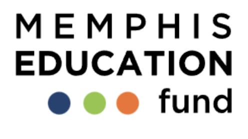

  

# MEF 90-Day Plan and 18-Month Strategic Alignment

## I. 90-Day Plan Goals

1. Strengthen Organizational Capacity
2. Enhance Charter School Support and Advocacy
3. Improve Data Management and Reporting
4. Secure Financial Stability

## II. Aligned 18-Month Impact Goals and 90-Day Objectives

### 1. Strengthen Organizational Capacity

**18-Month Goal:**
- Solidify MEF as "go-to" problem solver for Memphis Charters

**90-Day Objectives:**
- a) Complete board transition
- b) Optimize staff allocation and project management

**KPI 1:** Percentage of staff time reallocated to priority projects
**Target:** 40% of staff time reallocated to priority projects by October 31, 2024

**KPI 2:** Staff role optimization
**Target:** 100% of staff with updated role descriptions and project assignments by September 30, 2024

**KPI 3:** Board transition completion rate
**Target:** 100% completion of planned board transition actions by October 15, 2024

**KPI 4:** Project management system implementation
**Target:** Fully implement new project management system with 90% staff adoption by October 31, 2024

### 2. Enhance Charter School Support and Advocacy

**18-Month Goals:**
- a) Develop SY2024-25 charter school policy agenda
- b) Win on at least 2 charter leader-directed issues
- c) Stand up a Coalition of 50 Charter Parents

**90-Day Objectives:**
- a) Develop and implement MEF's charter leader engagement framework
- b) Identify key charter school policy impact areas by September 30, 2024

**KPI 1:** Number of one-on-one meetings with charter leaders
**Target:** Meet with 100% of priority Memphis charter leaders by October 30, 2024

**KPI 2:** Charter school leader meeting participation rate
**Target:** 80% Charter school leader participation in monthly coalition meetings through 10/30

**KPI 3:** Number of key charter school policy impact areas identified
**Target:** Identify at least 3 key policy impact areas by September 30, 2024

**KPI 4:** Percentage of charter leaders providing input on policy priorities
**Target:** Obtain input from 75% of engaged charter leaders by October 15, 2024

**KPI 5:** Number of charter parents recruited for the coalition
**Target:** Recruit an initial group of 20 parents by October 31, 2024

**KPI 6:** Percentage completion of MEF's charter leader engagement framework
**Target:** 100% completion of framework development by September 30, 2024

**KPI 7:** Percentage completion of initial draft for SY2024-25 charter school policy agenda
**Target:** 50% completion of first draft by October 31, 2024

### 3. Improve Data Management and Reporting

**18-Month Goals:**
- a) Produce 4 quarterly Impact Reports
- b) Collect and analyze data from 90% of Memphis Charters

**90-Day Objectives:**
- a) Clean and organize existing MEF Charter School Database
- b) Develop data collection and analysis framework

**KPI 1:** Percentage completion of database cleaning
**Target:** 100% completion of database cleaning by September 30, 2024

**KPI 2:** Number of potential data projects mapped for SY2024-25
**Target:** 6 projects mapped by October 15, 2024

**KPI 3:** Percentage of data collection framework developed
**Target:** 100% completion of data collection framework by October 31, 2024

**KPI 4:** Number of charter schools engaged in initial data sharing discussions
**Target:** Initiate data sharing discussions with 50% of Memphis Charter Schools by October 31, 2024

**KPI 5:** Percentage completion of first quarterly Impact Report draft
**Target:** 75% completion of Q1 FY2025 Impact Report draft by October 31, 2024

**KPI 6:** Number of key data metrics identified for tracking
**Target:** Identify and define 15 key data metrics across all charter schools by October 15, 2024

### 4. Secure Financial Stability

**90-Day Objectives:**
- a) Grant Management
- b) Fundraising

**KPI 1:** Percentage of SY2024-25 Academic Accountability grants managed effectively
**Target:** 100% of grants managed according to timeline and requirements by October 31, 2024

**KPI 2:** Development of grant management infrastructure
**Target:** Complete initial framework for Academic Support grant management by October 15, 2024

**KPI 3:** Number of potential new donors identified
**Target:** Identify and research 10 potential new donors by October 31, 2024

**KPI 4:** Funding secured for near-term operations
**Target:** Secure funding to cover operations through December 31, 2024 by October 15, 2024

## III. Additional KPIs and Targets (60-Day Focus)

### 5. Communications and Outreach

**KPI 1:** Social media engagement for MEF content
**Target:** Increase engagement rate by 10% across all platforms by October 30, 2024

**KPI 2:** Development of content calendar
**Target:** Create a 3-month content calendar by September 30, 2024

### 6. Strategic Planning

**KPI 1:** Completion of decision tree for Crosstown Lease
**Target:** 100% completion by October 15, 2024

**KPI 2:** Stakeholder input for strategic planning
**Target:** Conduct interviews or surveys with 80% of board members and key staff by October 30, 2024

### 7. Research Capacity

**KPI 1:** Development of hiring strategy for research fellows
**Target:** Complete first draft of strategy document by October 15, 2024

**KPI 2:** Research needs assessment
**Target:** Complete a comprehensive research needs assessment by October 30, 2024

## IV. ROLES AND RESPONSIBILITIES (90-day plan: August 1 - October 30, 2024)

### 1. CEO/Executive Director

- Lead one-on-one meetings with all priority Memphis charter leaders (Workstream 2a, Task 1)
- Work with AI on board development (Workstream 1a)
- Oversee creation of decision tree for Crosstown Lease (Workstream 6, Task 1)
- Collaborate on gathering stakeholder input for strategic planning (Workstream 6, Task 2)
- Oversee fundraising efforts and donor identification (Workstream 4b)

### 2. Director, Charter Policy

- Determine key policy impact areas and define strategy (Workstream 2b, Task 1)
- Gather input on policy priorities from charter leaders (Workstream 2b, Task 2)
- Develop initial draft of charter school policy agenda (Workstream 2b, Task 3)
- Collaborate on development of MEF's charter leader engagement framework (Workstream 2a, Task 3)
- Manage SY2024-25 Academic Accountability grants (Workstream 4a)

### 3. Director, School Relations

- Lead monthly charter leader meetings (Workstream 2a, Task 2)
- Recruit charter parents for coalition (Workstream 2c)
- Serve as daily interface with charter leaders
- Support engagement of charter schools in data sharing discussions (Workstream 3c, Task 2)

### 4. Manager, Communications

- Develop and implement social media strategy (Workstream 5, Task 1)
- Create content calendar (Workstream 5, Task 2)
- Support preparation of Impact Report draft (Workstream 3b, Task 1)

### 5. Manager, Data + Research

- Clean Existing MEF Charter School Database (Workstream 3a, Task 1)
- Develop data collection framework (Workstream 3a, Task 2)
- Identify key data metrics (Workstream 3b, Task 2)
- Map potential data projects (Workstream 3c, Task 1)
- Develop hiring strategy for research fellows (Workstream 7, Task 1)
- Conduct research needs assessment (Workstream 7, Task 2)

## V. MILESTONES AND CHECK-INS (90-day plan)

### Month 1 (August 2024):

#### Week 1-2 (August 1-14):

- CEO: Complete 25% of one-on-one meetings with priority Memphis charter leaders
- Director, Charter Policy: Draft initial list of 4-5 potential policy impact areas
- Manager, Data + Research: Begin cleaning MEF Charter School Database (25% complete)

#### Week 3-4 (August 15-31):

- Director, School Relations: Hold first monthly charter leader meeting (target 70% participation)
- Manager, Communications: Complete draft of social media strategy and content calendar
- CEO: Initiate board transition actions

### Month 2 (September 2024):

#### Week 5-6 (September 1-14):

- CEO: Complete 50% of one-on-one meetings with priority Memphis charter leaders
- Director, Charter Policy: Finalize 3 key policy impact areas and start gathering input
- Manager, Data + Research: Complete cleaning of MEF Charter School Database

#### Week 7-8 (September 15-30):

- Director, School Relations: Hold second monthly charter leader meeting (target 75% participation)
- Manager, Communications: Launch initial phase of social media strategy
- CEO: Complete draft of decision tree for Crosstown Lease

### Month 3 (October 2024):

#### Week 9-10 (October 1-14):

- CEO: Complete 100% of one-on-one meetings with priority Memphis charter leaders
- Director, Charter Policy: Complete 50% of initial draft for SY2024-25 charter school policy agenda
- Manager, Data + Research: Complete mapping of 6 potential data projects for SY2024-25

#### Week 11-13 (October 15-30):

- Director, School Relations: Hold third monthly charter leader meeting (target 80% participation)
- Manager, Communications: Achieve 10% increase in social media engagement rate
- Manager, Data + Research: Complete 75% of Q1 FY2025 Impact Report draft
- CEO: Secure funding through December 31, 2024

### Check-ins:

1. Weekly team meetings: Each team member provides a brief update on their progress towards KPIs and any challenges.
2. Bi-weekly one-on-ones: CEO meets with each director and manager to discuss individual progress on tasks and KPIs.
3. Monthly all-hands meeting: Review overall progress on workstreams, celebrate KPI achievements, and address any cross-functional challenges.
4. End-of-month reports: Each team member submits a written summary of their progress, including metrics aligned with their KPIs and next steps.

### Key Performance Indicators (KPIs) to track at check-ins:

1. Percentage of one-on-one meetings completed with priority Memphis charter leaders
2. Charter school leader meeting participation rate
3. Number of key charter school policy impact areas identified
4. Percentage completion of MEF Charter School Database cleaning
5. Social media engagement rate increase
6. Percentage completion of board transition actions
7. Number of potential data projects mapped for SY2024-25
8. Percentage completion of charter leader engagement framework
9. Number of charter parents recruited for coalition
10. Percentage completion of data collection framework
11. Percentage completion of Q1 FY2025 Impact Report draft
12. Percentage of grants effectively managed
13. Number of potential new donors identified
14. Amount of funding secured for operations through December 31, 2024
